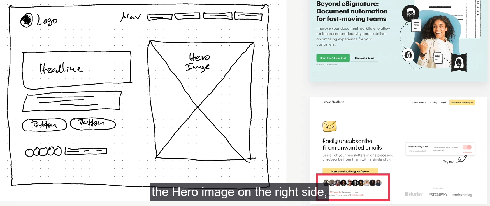

## Planning
### Step 1
1. Who the website is for ? 
- Client
2. What the website is for ? 
- Business goal: Selling monthly food subs
- User goal: Eating well effortlessly, without spending a lot of time and money.
3. Target audience:
- Busy people who loves tech, are interest in healthy diet and have a well-paying job.

### Step 2: Plan the project
1. Sitemap: one-page
2. Personality: startup/upbeat. May add some calm/peaceful personality.

## Sections:
1. Hero:
   - Image:
   - 